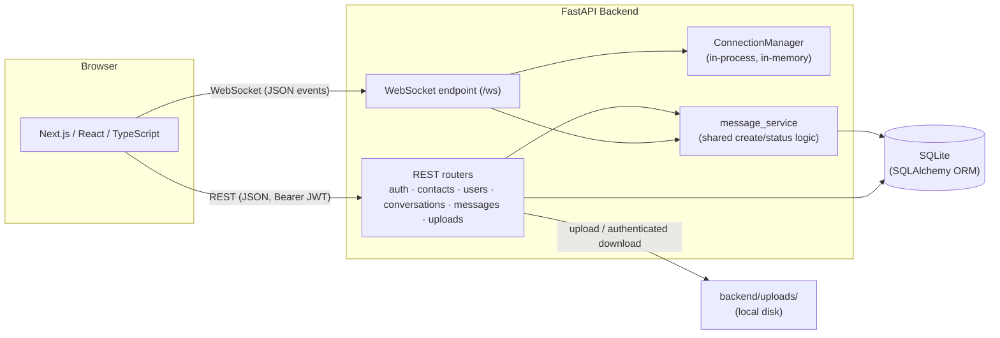

# Secure Messaging Platform — Signal Clone

## 1. Overview

This is a full-stack, Signal-inspired secure messaging platform built for an SDE Fullstack assignment. It implements authentication (with a mocked OTP step), contacts and user discovery, direct and group conversations, real-time messaging over WebSockets, delivery/read receipts, typing indicators, group administration, basic file attachments, a Signal-style UI with light/dark/system theming, and a responsive mobile/desktop layout.

**This is not the real Signal application.** It is an educational clone built to demonstrate full-stack application architecture and real-time messaging mechanics. It does **not** implement the real Signal Protocol or production end-to-end encryption, and it is **not affiliated with, endorsed by, or associated with Signal Messenger LLC** in any way.

**Stack** (as actually used in this repository):

| Layer | Technology |
|---|---|
| Frontend | Next.js 16 (App Router), React 19, TypeScript, Tailwind CSS v4 |
| Backend | Python, FastAPI, SQLAlchemy 2.0 |
| Database | SQLite |
| Realtime | A single native FastAPI/Starlette WebSocket endpoint (`/ws`) |
| Auth | JWT (PyJWT) + bcrypt password hashing |
| Testing | pytest (backend), `tsc`/ESLint/`next build` (frontend) |

## 2. Assignment Compliance

Only requirements that are actually implemented are listed as PASS.

| Requirement | Implementation | Status |
|---|---|---|
| Authentication / onboarding | JWT-based auth; identity is always derived server-side from the token, never trusted from the client (`backend/app/core/deps.py`) | PASS |
| Mock OTP | Fixed development code **`1234`** (`backend/app/core/config.py` → `mock_otp_code`), checked by `POST /auth/register/verify-otp` | PASS |
| Login/logout/session persistence | `POST /auth/login` issues a JWT; `GET /auth/me` restores the session on refresh (`frontend/lib/auth-context.tsx`) | PASS |
| User isolation | Every conversation/message/contact route scopes by the authenticated `current_user.id`; non-members get `404`, not `403` (no existence leak) | PASS |
| Contacts | `GET/POST/DELETE /contacts` (`backend/app/routers/contacts.py`) | PASS |
| Username search | `GET /users/search?q=` matches username/display name/phone (`backend/app/routers/users.py`) | PASS |
| Conversation list | Sorted by most recent activity, with unread counts (`backend/app/routers/conversations.py`) | PASS |
| Direct messaging | `POST /conversations/direct` deduplicates via a deterministic `direct_key` | PASS |
| Message persistence | `messages` table, cursor-paginated history (`GET .../messages?before_id=`) | PASS |
| Delivery receipts | Per-recipient `message_status` row, explicit client ack (`message_delivered` WS event) | PASS |
| Read receipts | `mark_read` WS event, aggregated status shown to the sender | PASS |
| Typing indicators | `typing_start`/`typing_stop` WS events, ephemeral (never persisted) | PASS |
| Groups | `type='group'` conversations with `conversation_participants.role` | PASS |
| Group creation | Name + member selection UI (`frontend/components/contacts/NewConversationModal.tsx`); backend requires a name and at least one other member | PASS |
| Group member search | Both group creation and "Add members" search all registered users via `GET /users/search`, not just existing contacts | PASS |
| Add/remove members | `POST`/`DELETE .../members` (admin-only) | PASS |
| Admin controls | `PATCH .../members/{user_id}` (promote/demote), last-admin-removal protection | PASS |
| Conversation sorting | By latest message time, falling back to `created_at` | PASS |
| Unread indicators | Backend-computed unread count per conversation | PASS |
| Presence | `is_online` driven by actual WebSocket connection count, not a static flag (`backend/app/websocket/endpoint.py::_set_presence`) | PASS |
| Search/filter | Sidebar search (name/username/last message) + an All/Unread/Groups filter (`frontend/components/conversation-list/ConversationList.tsx`) | PASS |
| Signal-style UI | Narrow nav rail, two-pane layout, message bubbles, shared icon set (`frontend/components/ui/icons.tsx`) | PASS |
| Settings | Profile (Account) and Appearance are functional; other sections are explicitly labeled "Coming soon" | PASS |
| Light/Dark/System theme | `frontend/lib/theme-context.tsx`, persisted to `localStorage`, no flash-of-wrong-theme | PASS |
| Responsive UI | Verified at 375/390/430px and desktop widths; mobile list↔chat navigation | PASS |
| Timestamp/timezone handling | Every API datetime is serialized with an explicit `Z` (UTC) suffix (`backend/app/schemas/common.py::UTCDatetime`); the frontend converts to the viewer's local time for display | PASS |
| File attachments | `POST /uploads` + message `message_type: "file"` (images/PDF/text/Word/zip, 10 MB max) | PASS |
| File authorization | `GET /uploads/{message_id}` requires auth and conversation membership — never a static file mount | PASS |
| WebSocket authorization | First-message `authenticate` handshake; every event handler re-checks conversation membership server-side | PASS |
| Database initialization | `init_db()` (idempotent `CREATE TABLE IF NOT EXISTS`) runs unconditionally on every backend startup | PASS |
| Idempotent seed | `db/seed.py` checks each of the 5 demo usernames individually before inserting; safe to run repeatedly | PASS |
| API documentation | FastAPI's built-in interactive docs at `/docs` and `/openapi.json`, plus the endpoint table in §10 below | PASS |
| Security | See §14 for the full implemented list and explicit limitations | PASS |

Not implemented (and not claimed): real Signal Protocol encryption, real SMS delivery, functional voice/video calls, functional stories, linked devices, message reactions/replies, disappearing messages. See §3 "UI / UX" and §16 for how Calls/Stories specifically are handled.

## 3. Features

### Authentication & Onboarding

- **Registration**: username, display name, password (min. 8 characters), optional phone number and avatar URL (`POST /auth/register`).
- **Two-step OTP registration** (what the actual UI uses): `POST /auth/register/request-otp` → `POST /auth/register/verify-otp`. The OTP is a fixed, disclosed development code:

  **Demo OTP: `1234`**

  This is intentionally mocked for the assignment — no SMS provider is integrated, no code is generated or stored, and the same value is correct for every registration. The frontend shows this value directly on the verification screen (`frontend/components/auth/RegisterForm.tsx`).
- **Login**: by username or phone number (`POST /auth/login`), returns a JWT.
- **Logout**: clears the token from `localStorage` and disconnects the WebSocket client-side; there is no server-side session/revocation store (JWTs are stateless).
- **Session restoration**: on load, a stored token is sent to `GET /auth/me`; if valid, the user is restored, otherwise the token is discarded and the app shows the login screen.
- **Seeded demo users**: `alice`, `bob`, `carol`, `dave`, `erin`, all with password `password123` (see §12). Seeding only creates database rows — it never issues a token or authenticates a session (seed data and an authenticated session are independent).

### Contacts & User Discovery

- `GET /users/search?q=` matches username, display name, or phone number, excludes the caller, capped at 20 results.
- Adding a contact (`POST /contacts/{user_id}`) is directional — A adding B does not make A appear in B's contacts.
- Removing a contact (`DELETE /contacts/{user_id}`) does not touch any existing conversation or message history.
- Starting a direct conversation (`POST /conversations/direct`) reuses an existing conversation with that user if one already exists, rather than creating a duplicate.

### Direct Messaging

- Real-time text delivery over a single authenticated WebSocket connection (`send_message` → `new_message`).
- Full persistence with cursor-based pagination (`GET .../messages?before_id=`).
- Every timestamp is UTC-labeled at the API boundary and rendered in the viewer's local time.
- Delivery (`message_delivered`) and read (`mark_read`) receipts, each a monotonic per-recipient status transition (`sent → delivered → read`, never backward).
- Typing indicators (`typing_start`/`typing_stop`), purely ephemeral, never persisted, with a client-side expiry fallback.
- On WebSocket reconnect, the client re-syncs via REST (conversation list + active thread) rather than assuming no events were missed while disconnected.

### Groups

- **Creation**: name the group and select members in one modal (`NewConversationModal.tsx`, Group mode). A group cannot be created without a name and at least one other member — enforced both in the UI and by the backend (`GroupConversationCreate` validator + a post-self-filter check in the route).
- **Username-based member search**: typing a username searches *all* registered users (`GET /users/search`), not just existing contacts.
- **Add contact + select in one step**: selecting a non-contact search result shows "Add contact"; clicking it adds the contact *and* immediately checks them in as a selected member — no need to close and reopen the modal.
- **Selected-member chips**: each selection renders as a removable chip above the search field.
- **Add/remove members** post-creation via Group Details → Add members, which also searches all registered users (a group admin may add any registered user — contact status is never required).
- **Promote/demote admins** (`PATCH .../members/{user_id}`), with protection against demoting or removing the group's last remaining admin.
- **Rename group** (admin-only), with blank-name rejection and whitespace trimming.
- **Realtime membership sync**: a `group_updated` WebSocket event (carrying only the conversation id, never membership data itself) tells clients to refetch the authoritative state from REST.

### File Attachments

- **Upload**: `POST /uploads`, multipart/form-data, authenticated. Validates the file extension *and* its declared MIME type together against an allowlist (never trusts the extension alone).
- **Allowed types**: images (`.jpg/.jpeg/.png/.gif/.webp`), `.pdf`, `.txt`, `.doc/.docx`, `.zip`. Anything else — including executables — is rejected.
- **Maximum size**: 10 MB, enforced while streaming the upload (rejects mid-stream, not just after the fact).
- **Storage**: the file is saved to `backend/uploads/` under a server-generated random (UUID) filename. The client-supplied original filename is kept only as display metadata (`attachment_filename`) — it is never used to build a filesystem path, which rules out path-traversal via a crafted filename.
- **Attaching to a message**: the frontend uploads first, then sends a message referencing the returned stored filename (`message_type: "file"` + attachment metadata). The backend re-validates that the referenced file actually exists and hasn't already been attached to a different message (single-use) before persisting the message.
- **Authenticated download**: `GET /uploads/{message_id}` — resolves the owning message, confirms it's a file message, and confirms the caller is a participant in that message's conversation before streaming anything. A non-participant gets `404`, not `403` (consistent with the rest of the app's non-leaking pattern).
- **WebSocket carries metadata only**: the `new_message` event includes the attachment's filename/MIME type/size/download path — never the raw file bytes.
- **Conversation-list preview**: a file message shows as "📎 filename" (or "📷 filename" for images) instead of raw content.

### Presence

`is_online` on a user is driven directly by the WebSocket `ConnectionManager`'s actual live connection count for that user (`backend/app/websocket/endpoint.py::_set_presence`) — not a static seeded value or a client-reported flag. A user with multiple open tabs/devices only goes offline once their *last* connection drops; `last_seen_at` is set at the moment the last connection closes.

### UI / UX

- **Navigation rail**: a persistent 64px icon rail (Chats / Calls / Stories / Settings), with the active item filled and others outlined.
- **Conversation sidebar**: compact rows (avatar, name, last-message preview, timestamp, unread badge), a search field, and an All/Unread/Groups filter.
- **Chat interface**: header (avatar, name, online/last-seen or member count), message bubbles (incoming/outgoing visually distinct), date separators, a composer with attach/send actions.
- **Settings**: Account (profile display) and Appearance (theme switch) are fully functional; General/Chats/Calls/Notifications/Privacy/Data usage/Backups/Donate are present in the navigation but explicitly show a "Coming soon" badge rather than silently doing nothing.
- **Light / Dark / System themes**: a full semantic-token theme system (`frontend/lib/theme-context.tsx`), switchable from Settings → Appearance, persisted across reloads, with no flash of the wrong theme on load.
- **Responsive layout**: verified at 375/390/430px (mobile) and standard desktop widths — mobile uses list↔chat navigation with a back button; desktop uses a fixed two-pane layout.
- **Calls and Stories are UI placeholders, not functional features.** Both have a real route (`/calls`, `/stories`) with a polished, Signal-style empty state, but every interactive element (new call, add a story, etc.) shows a "not available yet" toast rather than performing any real action — no fake call history or fake stories are fabricated.

## 4. Screenshots

No screenshots currently exist in this repository. Add them to a `screenshots/` directory and reference them here before final submission.

## 5. Architecture



- **REST** handles all persistent CRUD and history: auth, contacts, user search, conversation/message history, group management, file upload/download.
- **WebSocket** (`/ws`, one connection per client) handles real-time events only: new messages, delivery/read receipts, typing, group-membership change notifications.
- **SQLite** is the single persistence layer for both paths — a REST write and a WebSocket-triggered write go through the same SQLAlchemy models.
- **`ConnectionManager`** (`backend/app/websocket/manager.py`) is a small in-process, in-memory registry mapping `user_id → set of open WebSocket connections`. It is intentionally not backed by Redis or any external pub-sub — this assignment targets a single FastAPI process. A multi-process deployment would need a shared broker (see §18).
- **`message_service`** is the one place message creation, attachment validation, and status-rank logic live, shared identically by the REST `POST .../messages` route and the WebSocket `send_message` handler.
- **`backend/uploads/`** is local filesystem storage, outside the request/response cycle for everything except the two upload endpoints — see §14 for why this is not durable in a deployed environment.

## 6. Project Structure

```
backend/
  app/
    core/        # config, JWT/password helpers, auth dependencies (get_current_user, membership checks)
    db/          # engine/session setup, init_db, seed data
    models/      # SQLAlchemy ORM models — one file per table
    schemas/     # Pydantic request/response models (incl. common.py's UTC datetime serializer)
    routers/     # REST endpoints: auth, contacts, users, conversations, messages, uploads
    services/    # shared business logic (message_service: creation, attachment validation, status rules)
    websocket/   # the /ws endpoint, event dispatch, ConnectionManager
    main.py      # FastAPI app, lifespan (init_db/seed), CORS, router registration
  tests/         # pytest suite — one file per feature area (216 tests, see §13)
  requirements.txt
  .env.example

frontend/
  app/
    (auth)/      # /login, /register — public routes
    (main)/      # /, /calls, /stories, /settings — authenticated routes (redirect to /login if signed out)
    layout.tsx   # root layout: ThemeProvider + AuthProvider + WebSocketProvider
  components/
    auth/        # login/register forms
    chat/        # message bubbles, composer, header, typing indicator, group details + add-member modals
    contacts/    # new conversation / new group modal
    conversation-list/
    layout/      # AppShell (top-level state), NavRail, Sidebar, MainChatArea
    ui/          # shared primitives (Avatar, Button, SearchInput, Spinner, Toast, icons, ...)
  lib/
    api.ts            # typed REST client (incl. file upload/download)
    ws.tsx             # WebSocketClient + React provider/hook
    auth-context.tsx
    theme-context.tsx  # light/dark/system theme state + persistence
    attachments.ts     # client-side upload validation helpers
    types.ts           # shared frontend types (mirrors backend schemas)
  package.json
  .env.example
```

## 7. Database Schema

Six tables:

| Table | Purpose |
|---|---|
| `users` | Account + profile data, password hash, live online/last-seen state |
| `contacts` | Directional "A knows B" relationship |
| `conversations` | A direct or group conversation (`type` discriminates) |
| `conversation_participants` | Membership rows; carries `role` (`member`/`admin`) for groups |
| `messages` | Message content, sender, conversation, timestamp, optional attachment fields |
| `message_status` | Per-recipient delivery state (`sent`/`delivered`/`read`) for one message |

- **Direct conversations** are deduplicated via `conversations.direct_key`, a deterministic, order-independent key computed from the two user IDs (`compute_direct_key`), with a unique constraint.
- **Group conversations** have `direct_key = NULL` and `type = 'group'`; membership and role live in `conversation_participants`.
- **`messages`** carries five attachment columns, all nullable, used only when `message_type = 'file'`: `attachment_filename` (original name, display only), `attachment_path` (server-generated stored filename), `attachment_mime_type`, `attachment_size`. A text message leaves all four `NULL`. These live directly on `Message` rather than in a separate `Attachment` table — the relationship is always exactly one-to-one (one file per message), so a join on every message-history read would add cost for no benefit.
- **`message_status`** exists per-recipient (not per-message) because a group message has multiple recipients who each progress through sent → delivered → read independently. The sender's own displayed status is derived, not stored — it's the minimum-rank status across that message's recipient rows.

```
User
 |
 +-- Contact (owner_id, contact_user_id)
 |
 +-- ConversationParticipant (user_id, conversation_id, role)
              |
              v
        Conversation (type, name, direct_key)
              |
              v
           Message (conversation_id, sender_id, content,
                     message_type, attachment_filename,
                     attachment_path, attachment_mime_type, attachment_size)
              |
              v
        MessageStatus (message_id, user_id, status)
```

## 8. Authentication

```
Registration:  POST /auth/register  →  bcrypt-hash the password  →  insert into users
Login:         POST /auth/login     →  verify bcrypt hash        →  issue a JWT (sub=user_id, exp)
```

**Registration also supports a mocked OTP verification flow**, which is what the actual frontend uses:

```
POST /auth/register/request-otp   →  returns a disclosed dev OTP (always "1234"); nothing is sent or stored
POST /auth/register/verify-otp    →  { ...registration fields, otp }  →  rejects (400) unless otp == "1234"
                                      →  on success, creates the account exactly like POST /auth/register
```

This is a **development mock only** — no SMS provider is integrated, no OTP is generated, persisted, or expired; the value is a single fixed constant (`settings.mock_otp_code`, `"1234"`) checked directly against the request. The plain `POST /auth/register` endpoint remains available and unchanged.

**Authenticated REST calls** send the token as a bearer header:
```
Authorization: Bearer <token>
```

**WebSocket authentication** is a first-message handshake, not a URL parameter:
```json
{ "type": "authenticate", "token": "<JWT>" }
```
The JWT is **never** placed in the WebSocket URL — it would otherwise end up in server access logs and browser network-history URLs.

There is no server-side logout/session-revocation endpoint — sessions are stateless JWTs; "logout" on the frontend removes the token from `localStorage` and disconnects the WebSocket.

**JWT identity is always authoritative over anything the client sends.** No endpoint accepts a client-supplied `user_id`/`sender_id` to determine whose data to return or whose action to attribute — identity comes only from `get_current_user`, which decodes the bearer token. This was specifically verified for the WebSocket `send_message` path (a client cannot forge another user's sender identity) and for conversation/message access (a non-participant gets `404` regardless of what they claim).

## 9. WebSocket Protocol

**Client → Server:** `authenticate`, `send_message`, `message_delivered`, `mark_read`, `typing_start`, `typing_stop`

**Server → Client:** `authenticated`, `new_message`, `message_status`, `messages_read`, `typing`, `group_updated`, `error`

Examples:

```json
// Client → Server: send_message (text)
{ "type": "send_message", "conversation_id": 3, "content": "hey, are we still on for Friday?" }
```

```json
// Client → Server: send_message (file — attaches a file already uploaded via POST /uploads)
{
  "type": "send_message",
  "conversation_id": 3,
  "content": "",
  "message_type": "file",
  "attachment_filename": "report.pdf",
  "attachment_path": "6f1e2c9b....pdf",
  "attachment_mime_type": "application/pdf",
  "attachment_size": 48213
}
```

```json
// Server → Client: new_message
{
  "type": "new_message",
  "message": {
    "id": 42,
    "conversation_id": 3,
    "sender": { "id": 1, "username": "alice", "display_name": "Alice Johnson", "avatar_url": null },
    "content": "hey, are we still on for Friday?",
    "message_type": "text",
    "attachment_filename": null,
    "attachment_mime_type": null,
    "attachment_size": null,
    "attachment_url": null,
    "created_at": "2026-10-07T14:30:00Z",
    "status": "sent"
  }
}
```

```json
// Client → Server: typing_start
{ "type": "typing_start", "conversation_id": 3 }
```

```json
// Client → Server: mark_read
{ "type": "mark_read", "conversation_id": 3 }
```

## 10. API Endpoints

**Auth**
| Method | Path | Description |
|---|---|---|
| POST | `/auth/register` | Create an account directly (no OTP) |
| POST | `/auth/register/request-otp` | Mock "send OTP" step — always returns the fixed dev code |
| POST | `/auth/register/verify-otp` | Verify the fixed OTP, then create the account |
| POST | `/auth/login` | Exchange credentials for a JWT |
| GET | `/auth/me` | Resolve the current user from a bearer token |

**Contacts**
| Method | Path | Description |
|---|---|---|
| GET | `/contacts` | List the current user's contacts |
| POST | `/contacts/{user_id}` | Add a contact |
| DELETE | `/contacts/{user_id}` | Remove a contact |

**Users**
| Method | Path | Description |
|---|---|---|
| GET | `/users/search?q=` | Discover registered users by username/display name/phone (excludes self, capped at 20 results) |

**Conversations**
| Method | Path | Description |
|---|---|---|
| GET | `/conversations` | List the current user's conversations, newest activity first |
| POST | `/conversations/direct` | Create or reuse a direct conversation |
| POST | `/conversations/group` | Create a group conversation (requires a name and ≥1 other member) |
| GET | `/conversations/{conversation_id}` | Get conversation + participant detail |
| PATCH | `/conversations/{conversation_id}` | Rename a group / update its avatar URL (admin-only) |

**Messages**
| Method | Path | Description |
|---|---|---|
| GET | `/conversations/{conversation_id}/messages` | Paginated message history |
| POST | `/conversations/{conversation_id}/messages` | Send a message over REST (text or file) |

**Groups / Member Management**
| Method | Path | Description |
|---|---|---|
| POST | `/conversations/{conversation_id}/members` | Add a member (admin-only) |
| DELETE | `/conversations/{conversation_id}/members/{user_id}` | Remove a member (admin-only) |
| PATCH | `/conversations/{conversation_id}/members/{user_id}` | Promote/demote a member's role (admin-only) |

**Uploads**
| Method | Path | Description |
|---|---|---|
| POST | `/uploads` | Upload a file (multipart/form-data); returns attachment metadata to attach to a subsequent message |
| GET | `/uploads/{message_id}` | Download a message's attachment — authenticated, and only if the caller is a participant in that message's conversation |

Plus `GET /health` (liveness check) and the WebSocket endpoint at `/ws`.

**Interactive API docs**: FastAPI auto-generates Swagger UI at `/docs` and the raw OpenAPI schema at `/openapi.json` whenever the backend is running — neither is disabled in this project.

## 11. Local Setup

**Backend:**
```bash
cd backend
python3 -m venv venv
source venv/bin/activate
pip install -r requirements.txt
cp .env.example .env
python -m app.db.init_db
python -m app.db.seed
uvicorn app.main:app --reload --port 8000
```

**Frontend:**
```bash
cd frontend
npm install
cp .env.example .env.local
npm run dev
```

The frontend reads its API base URL from:
```
NEXT_PUBLIC_API_URL=http://localhost:8000
```

**CORS:** the backend's allowed origin list (`cors_origins` in `backend/app/core/config.py`) defaults to `http://localhost:3000` only. If the frontend runs on a different origin or port, add it to `cors_origins` (or set it via environment configuration) — otherwise the browser will block every request with a CORS error.

**File uploads:** `backend/uploads/` is created automatically on first backend startup — no manual step required.

## 12. Seed Credentials

*Development only — never use these in a real deployment.*

Running `python -m app.db.seed` creates five users, all sharing the password below:

| Username | Display name |
|---|---|
| `alice` | Alice Johnson |
| `bob` | Bob Smith |
| `carol` | Carol Davis |
| `dave` | Dave Wilson |
| `erin` | Erin Clark |

Password for all seed users: `password123`

Seeding only inserts database rows — it never issues a JWT or otherwise authenticates a session. A fresh browser session (or an incognito window) with no stored token is always shown the login/register screen, regardless of what demo data exists in the database.

## 13. Testing

**Backend: 216 tests passing.**

```bash
cd backend
source venv/bin/activate
pytest -q
```

| Test file | Count | Covers |
|---|---|---|
| `test_auth.py` | 14 | Registration, login, JWT issuance/validation, `/auth/me` |
| `test_otp.py` | 11 | Mock OTP request/verify flow, correct/wrong/missing code |
| `test_contacts.py` | 9 | List/add/remove contacts, authorization |
| `test_users.py` | 10 | User search/discovery, self-exclusion, result cap |
| `test_conversations.py` | 23 | Direct dedup, group creation + validation, listing, detail, sorting |
| `test_group_management.py` | 37 | Add/remove/promote/demote/rename, admin authorization, realtime sync |
| `test_messages.py` | 31 | Send, persist, paginate, content validation, sender-identity integrity |
| `test_message_status.py` | 23 | Delivery/read status transitions, group aggregation |
| `test_attachments.py` | 13 | Upload auth/size/type/path-safety, message persistence, single-use, download authorization |
| `test_timestamps.py` | 6 | UTC serialization across REST/WebSocket/preview, REST↔WS equality |
| `test_websocket.py` | 26 | Connection lifecycle, auth, realtime delivery, presence, sender-id injection rejection |
| `test_security.py` | 2 | Auth-required edge cases, no password-hash leakage |
| `test_seed.py` | 11 | Seed idempotency, per-account behavior |

**Frontend:**
```bash
cd frontend
npx tsc --noEmit
npm run lint
npm run build
```
All three complete with no errors.

## 14. Security Considerations

**Implemented:**
- bcrypt password hashing
- JWT with expiration (`exp` claim)
- JWT secret read from environment configuration, not hardcoded for production use
- Per-request authorization (every conversation/message/group/upload route checks membership)
- Group admin authorization, enforced server-side independent of frontend UI hiding
- Per-recipient message status rows, so one user's status can never be read or written as another's
- JWT sent only in the WebSocket message body, never in the connection URL
- Input validation (message length/emptiness, group name, role enum, malformed JSON/WebSocket events all rejected safely)
- `password_hash` is never included in any API response
- File attachments are served only through an authenticated, membership-checked endpoint (`GET /uploads/{message_id}`) — never a static/public file mount. A client-supplied filename is never used as a filesystem path (stored files get a server-generated random name); extension and declared MIME type are both checked against an allowlist; executables are rejected outright

**Limitations (explicit, by assignment design):**
- No real end-to-end encryption — this is not a production-secure messaging product
- JWT is stored in browser `localStorage`, which is the assignment-acceptable approach but is not resistant to XSS the way an httpOnly cookie would be
- The WebSocket connection manager is in-process/in-memory — it does not survive a process restart and does not span multiple backend processes
- SQLite is appropriate for assignment/demo scale, not for concurrent production load
- Phone-based OTP verification is mocked (a single fixed code, `1234`, checked directly by `POST /auth/register/verify-otp`) rather than real SMS delivery
- **File attachments are stored on local disk (`backend/uploads/`), which is NOT durable on an ephemeral filesystem** (e.g. Render's default disk) — every uploaded file is lost on redeploy/restart, exactly like SQLite's own persistence caveat above. A production deployment would need object storage (S3-compatible) instead

This application should not be described as production-secure.

## 15. Deployment Notes

- **Backend:** runs under FastAPI/Uvicorn (`uvicorn app.main:app`).
- **Frontend:** a standard Next.js app (`npm run build && npm run start`).
- Required environment variables: `SIGNAL_JWT_SECRET_KEY`, `SIGNAL_JWT_ALGORITHM`, `SIGNAL_ACCESS_TOKEN_EXPIRE_MINUTES` (backend); `NEXT_PUBLIC_API_URL` (frontend).
- **A production JWT secret MUST be supplied through environment configuration** — the code ships with an insecure, clearly-labeled development default that must never be reused.
- **CORS must include the deployed frontend's real origin** — the default only allows `localhost:3000`.
- SQLite's persistence, and the local-disk attachment storage, both depend entirely on the deployment environment's filesystem — an ephemeral filesystem (common on many PaaS platforms) loses both on redeploy.

No deployment URL exists for this project — it has not been deployed.

## 16. Assignment Assumptions

- Phone-based OTP is mocked with a single fixed development code (`1234`), not real SMS, per the assignment's explicit allowance.
- Real Signal cryptographic protocol is not implemented, per the assignment's explicit allowance.
- Voice/video calls have a dedicated `/calls` route with a Signal-style UI, but every action is an inert "not available yet" placeholder — no real calling is implemented.
- Stories has a dedicated `/stories` route with a Signal-style UI (My Story entry, empty state), but every action is an inert "not available yet" placeholder — no real stories backend exists.
- Linked devices are out of scope and not present at all, not even as a placeholder route.
- SQLite was chosen as the persistence layer for assignment scope; see §18 for a production alternative.
- Redis/external pub-sub was intentionally omitted — a single in-process `ConnectionManager` is sufficient for a single-process deployment target.
- Local disk was chosen for attachment storage for assignment scope; see §18 for a production alternative.
- Contacts can be discovered via `GET /users/search` (username/display name/phone) and added directly from the UI — not limited to seed data.
- Group membership is modeled through `conversation_participants`, shared with direct conversations rather than a separate group-specific table.

## 17. Known Limitations

- No real Signal Protocol end-to-end encryption.
- No real SMS delivery for OTP (a single fixed mock code, `1234`, is used instead).
- File attachments use local disk storage, not durable object storage — lost on redeploy to an ephemeral filesystem (see §14/§15).
- No functional voice or video calls (UI placeholder only — see §16).
- No functional stories (UI placeholder only — see §16).
- No linked devices.
- Registration's OTP step is a single fixed, disclosed development code (`1234`) — it demonstrates the flow the assignment describes, not real verification, and the same code is correct for every registration.
- A single uploaded file per message; no multi-attachment messages.

## 18. Future Improvements

- Implement the real Signal Protocol for genuine end-to-end encryption
- Move persistence to PostgreSQL for production-scale concurrent access
- Introduce Redis (or another pub/sub broker) to let the WebSocket layer span multiple backend processes/instances
- Add object storage (e.g. S3-compatible) for message attachments, replacing local disk
- Add push notifications for backgrounded/closed clients
- Replace the mocked OTP with a real SMS provider integration
- Add refresh-token rotation instead of a single long-lived access token
- Move the JWT out of `localStorage` into a more XSS-resistant storage strategy (e.g. httpOnly cookie + CSRF protection)
- Implement real voice/video calling and stories behind the existing `/calls` and `/stories` UI shells
